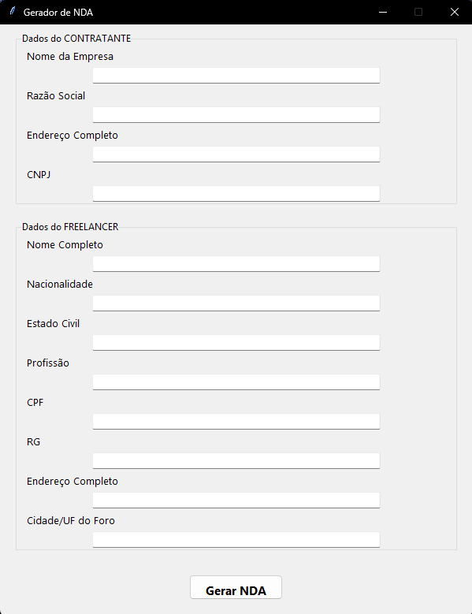

# 🛡️ Gerador de Contrato NDA (Acordo de Confidencialidade)

Este é um gerador de contrato de confidencialidade (NDA) com interface gráfica em Python. Ele permite que você preencha as informações da empresa contratante e do freelancer, e gere automaticamente o contrato nos formatos `.docx` (Word) e `.pdf`.

---

## ✨ Funcionalidades

- Interface gráfica moderna com Tkinter (`ttk`)
- Geração automática de contrato com dados personalizados
- Criação do arquivo `.docx` com `python-docx`
- Conversão para PDF **sem depender do Microsoft Word** usando `reportlab`

---

## 🖼️ Interface



---

## 🛠️ Tecnologias Utilizadas

- Python 3.8+
- `tkinter` – Interface gráfica
- `python-docx` – Criação de arquivos .docx
- `reportlab` – Geração de PDF
- `datetime` – Para data atual

---

## 📦 Instalação

1. Clone o repositório:

```bash
git clone https://github.com/PedroVMB/GeradorNDA-Python.git
cd gerador-nda
```

2. Crie um ambiente virtual (opcional, mas recomendado):

```bash
python -m venv venv
source venv/bin/activate  # Linux/macOS
venv\Scripts\activate      # Windows
```

3. Instale as dependências: 

```bash
pip install -r requirements.txt
```

## 🚀 Como Usar

1. Execute o script principal:

```bash
python main.py
```
2. Preencha os dados solicitados na interface (empresa e freelancer).

3. Clique em "Gerar NDA".

Os arquivos Acordo_Confidencialidade_Gerado.docx e Acordo_Confidencialidade_Gerado.pdf serão salvos na mesma pasta.

📁 Estrutura do Projeto
``` bash
gerador-nda-rommanel/
├── main.py               # Script principal com a interface e lógica
├── README.md             # Este arquivo
├── requirements.txt      # Dependências do projeto
└── screenshot.png        # (Opcional) Imagem da interface para o GitHub
```

### ✅ Requisitos

Python 3.8 ou superior

Sistema operacional: Windows, macOS ou Linux

Não requer Microsoft Word instalado!

### 📃 Licença
Este projeto está licenciado sob a MIT License.

### 🤝 Contribuições
Contribuições são bem-vindas! Sinta-se à vontade para abrir issues ou pull requests.

### 💬 Contato
Desenvolvido por Pedro Vinicius Mota Barreiro.
📧 Email: pedromb.dev@gmail.com

